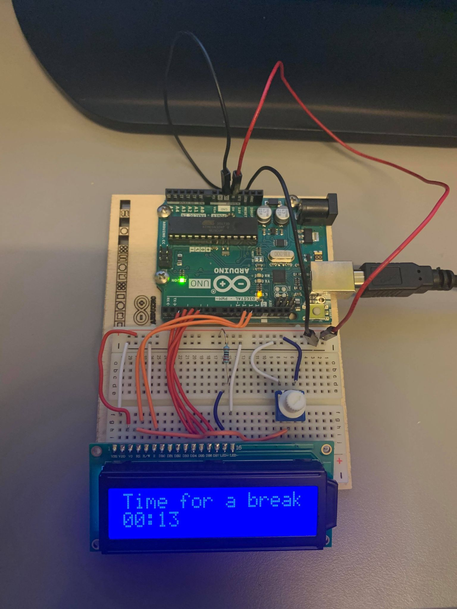

# DigiFab-2021

Collection of projects for digital fabrication course that I audited for a few weeks in the spring of 2021: DigiFab ITF50020-1 21V at Østfold University College

## The projects I made:

### 1. 3D modeling using Fusion 360 and a SVG image using Inkscape

**Description**:

- I created a 3D model of a Lego figure using Fusion 360
- I created a SVG image of Baby Yoda

**Tools**:

- Fusion 360
- Inkscape

**Photos**:

### 2. Arduino project

**Description**:

- I created a simple Pomodoro timer using an Arduino board and a small screen

**Tools**:

- Arduino IDE

**Photos**:

